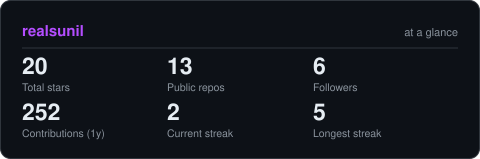
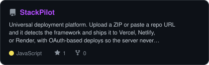
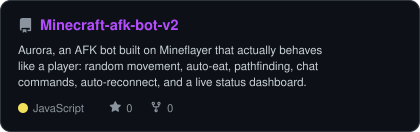
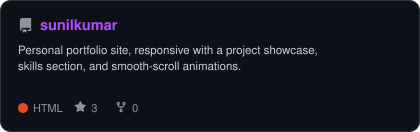

<div align="center">

<!-- PORTRAIT - generated by scripts/dotify.py from assets/jacket.jpg.
     Colour mode, so one file serves both GitHub themes. Regenerate with:
       python scripts/dotify.py assets/jacket.jpg -o assets/portrait \
         --cols 100 --equalize --detail 0.5 --color --focus 0.5,0.42 --reveal -->


<br>

<!-- NAME / TAGLINE - animated typing -->
<a href="https://github.com/realsunil">
  
</a>

<br>

<!-- SOCIALS -->
<a href="https://www.linkedin.com/in/sunilkofficial/"></a>
<a href="https://sunilkumar.pages.dev"></a>
<a href="https://discord.gg/Nr5EssRyP5"></a>
<a href="https://www.instagram.com/realsunil__"></a>
<a href="https://youtube.com/@sunilgaming_op"></a>
<a href="https://youtube.com/@BotSync"></a>


</div>

---

## `~/` whoami

```console
$ cat about.txt
```

Hi, I'm **Sunil**. I build things that live between Discord, Minecraft servers, and the
web — bots that never sleep, worlds that stay online, and interfaces that don't feel
like an afterthought.

- Currently running **20+ Discord bots** in production and building **[StackPilot](https://github.com/realsunil/StackPilot)**
- Portfolio: **[sunilkumar.pages.dev](https://sunilkumar.pages.dev)**
- Learning **AI-powered Discord bots** — embedding LLMs to make them smarter, faster, unstoppable
- Motto: **"Code with passion. Build with purpose. Create with impact."**

<br>

<div align="center">

## `~/` toolbox


</div>

---

<div align="center">

## `~/` skill radar

<table>
<tr>
<td width="50%" align="center" valign="middle">

<!-- Self-rated radar - edit assets/skills.json, the workflow redraws it -->
<picture>
  <source media="(prefers-color-scheme: dark)"  srcset="assets/radar-dark.svg">
  <source media="(prefers-color-scheme: light)" srcset="assets/radar-light.svg">
  
</picture>

</td>
<td width="50%" align="center" valign="middle">

<!-- Live radar built from real language byte counts across your repos -->
<picture>
  <source media="(prefers-color-scheme: dark)"  srcset="assets/radar-langs-dark.svg">
  <source media="(prefers-color-scheme: light)" srcset="assets/radar-langs-light.svg">
  
</picture>

</td>
</tr>
</table>

</div>

---

<div align="center">

## `~/` contribution calendar

<!-- 3D isometric calendar, regenerated every 6h by .github/workflows/metrics.yml -->


<br><br>

<!-- Snake eats the contribution graph - .github/workflows/snake.yml -->
<picture>
  <source media="(prefers-color-scheme: dark)"  srcset="https://raw.githubusercontent.com/realsunil/realsunil/output/snake-dark.svg">
  <source media="(prefers-color-scheme: light)" srcset="https://raw.githubusercontent.com/realsunil/realsunil/output/snake.svg">
  
</picture>

</div>

---

<div align="center">

## `~/` the numbers

<!-- Generated by scripts/cards.py into this repo. Deliberately NOT
     github-readme-stats / streak-stats / github-profile-trophy: those are
     shared public instances that go down and take the whole section with them. -->
<picture>
  <source media="(prefers-color-scheme: dark)"  srcset="assets/card-stats-dark.svg">
  <source media="(prefers-color-scheme: light)" srcset="assets/card-stats-light.svg">
  
</picture>

<br>


<br><br>


</div>

---

<div align="center">

## `~/` selected work

<!-- Cards generated by scripts/cards.py from assets/projects.json.
     Stars, forks and language are pulled live from the API on every run. -->
<table>
<tr>
<td width="50%">
  <a href="https://github.com/realsunil/StackPilot">
    <picture>
      <source media="(prefers-color-scheme: dark)"  srcset="assets/card-StackPilot-dark.svg">
      <source media="(prefers-color-scheme: light)" srcset="assets/card-StackPilot-light.svg">
      
    </picture>
  </a>
</td>
<td width="50%">
  <a href="https://github.com/realsunil/Minecraft-afk-bot-v2">
    <picture>
      <source media="(prefers-color-scheme: dark)"  srcset="assets/card-Minecraft-afk-bot-v2-dark.svg">
      <source media="(prefers-color-scheme: light)" srcset="assets/card-Minecraft-afk-bot-v2-light.svg">
      
    </picture>
  </a>
</td>
</tr>
<tr>
<td width="50%" colspan="2">
  <a href="https://github.com/realsunil/sunilkumar">
    <picture>
      <source media="(prefers-color-scheme: dark)"  srcset="assets/card-sunilkumar-dark.svg">
      <source media="(prefers-color-scheme: light)" srcset="assets/card-sunilkumar-light.svg">
      
    </picture>
  </a>
</td>
</tr>
</table>

<sub>

| project | live | stack |
|---|---|---|
| **[StackPilot](https://github.com/realsunil/StackPilot)** | [stackpilotdev.vercel.app](https://stackpilotdev.vercel.app) | `JavaScript` `Node.js` `MongoDB` |
| **[Minecraft-afk-bot-v2](https://github.com/realsunil/Minecraft-afk-bot-v2)** | self-hosted | `JavaScript` `Mineflayer` |
| **[sunilkumar](https://github.com/realsunil/sunilkumar)** | [sunilkumar.pages.dev](https://sunilkumar.pages.dev) | `HTML` `CSS` `JavaScript` |

</sub>

</div>

---

<div align="center">

## `~/` contribution matrix

<picture>
  <source media="(prefers-color-scheme: dark)" srcset="https://raw.githubusercontent.com/realsunil/realsunil/output/github-contribution-grid-snake-dark.svg"/>
  <source media="(prefers-color-scheme: light)" srcset="https://raw.githubusercontent.com/realsunil/realsunil/output/github-contribution-grid-snake.svg"/>
  
</picture>

</div>

---

<div align="center">

## `~/` open for collab

<br>

```
╔══════════════════════════════════════════════════════════════════╗
║                                                                  ║
║   ◈  Discord Bot Dev    ◈  Minecraft Setups    ◈  Web Dev        ║
║   ◈  Video Editing      ◈  Freelance Work      ◈  Collabs        ║
║                                                                  ║
║          D M S  O P E N  •  L E T ' S  B U I L D               ║
╚══════════════════════════════════════════════════════════════════╝
```

<br>

[](https://discord.gg/Nr5EssRyP5)

<br>

*If my work helped you — a ⭐ means the world to me.*

</div>

---

<div align="center">

<sub>`01100011 01101111 01100100 01100101 00100000 01101110 01100101 01110110 01100101 01110010 00100000 01110011 01101100 01100101 01100101 01110000 01110011`</sub>

</div>
